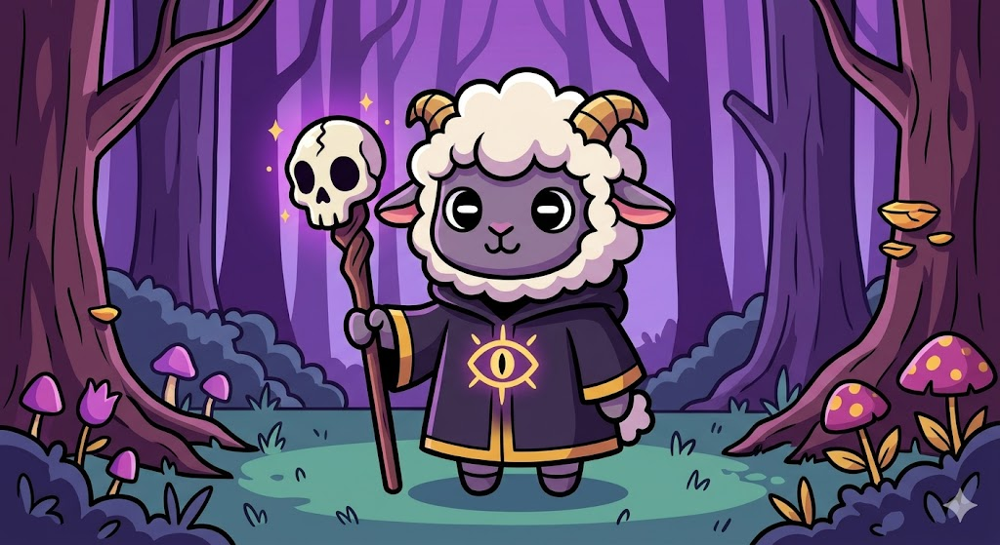

# 怪诞反差萌卡通风 (Grotesque Occult Cartoon)

关联总览表 #4 [手绘卡通风 / Hand-drawn Cartoon](../../README.md#1-2d-游戏典型画风总览20-种)(《羔羊教派》一脉)。



> **图 3**:可爱但毛骨悚然的邪教绵羊。bold black outlines 配合紫金撞色,完美还原了《羔羊教派》那种通过视觉反差制造"成瘾性"的怪诞美学。

## 风格还原点

- **Q 版角色比例**:圆润大头、萌系体型,降低威胁感制造反差
- **大胆扁平色块(Flat Cel-Shading)**:粗黑描边 + 平涂上色,几乎无渐变
- **诡异符号撞色**:宗教 / 克苏鲁元素(全视之眼、骷髅法杖)+ 紫金高对比撞色
- **反差萌**:可爱外形包裹黑暗 / 邪典主题,形成"成瘾性"视觉张力

## 参考 Prompt

```
grotesque occult cartoon 2D character art, cute chibi cult sheep in a dark robe holding a
skull staff, bold black outlines, flat cel-shading, eerie purple-and-gold color clash,
all-seeing-eye and cthulhu-esque religious symbols, whimsical yet unsettling mood,
spooky purple forest background, Cult of the Lamb inspired
```

**Negative**: realistic, soft gradients, photorealism, 3D render, gritty horror gore, muted colors, no outlines.

> 来源:用户上传示例图(`cult-sheep.png`)。
