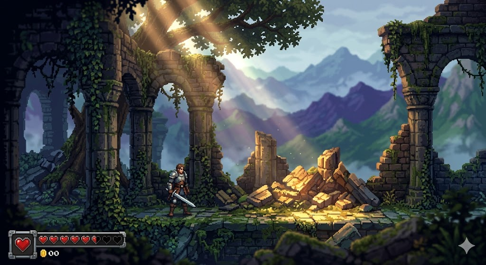

# 高精度像素风 (High-detail Pixel Art / HD-2D)

关联总览表 #2 [高精度像素风 / High-detail Pixel Art](../../README.md#1-2d-游戏典型画风总览20-种),即《八方旅人》《星之海》一脉的 HD-2D。



> **图 5**:2.5D 横版过关场景。体积光穿过树冠洒在残垣断壁上,背景多层视差群山,冷暖光影对比强烈,复古金属质感 UI——像素颗粒之上叠加电影级光影氛围。

## 风格还原点

- **次世代动态光影**:体积光(god rays)、景深、冷暖对比,像素之上的电影级打光
- **多层视差背景**:前景遗迹 / 中景废墟 / 远景群山,纵深层次分明
- **精致环境细节**:苔藓、藤蔓、碎石、金币散落,信息密度高但主角剪影清晰
- **复古金属 UI**:血条 / 金币计数带金属质感,呼应横版动作类玩法

## 参考 Prompt

**中文**:2.5D 横版过关游戏场景,高精度像素艺术,一位剑士站在长满苔藓的遗迹前,体积光穿过树冠洒在残垣断壁上,景深效果,背景是多层视差滚动的群山,冷暖光影对比强烈,UI 带有复古金属质感,电影级氛围,精致的环境细节。

**English**:
```
2.5D side-scrolling game environment, high-detail pixel art style, a swordsman standing
before moss-covered ancient ruins, volumetric lighting ray-tracing through tree canopies
hitting the debris, depth of field, multi-layered parallax scrolling mountains in the
background, strong warm-cool lighting contrast, retro metallic UI elements, cinematic
atmosphere, intricate environmental details.
```

**Negative**: 3D render, photorealistic, low resolution, blurry, rough sketch, modern photo, flat perspective.

**Keywords**: high-detail pixel art, 2.5D, volumetric lighting, parallax background, HD-2D

> 来源:用户提供 Prompt 与示例图(`swordsman-ruins.png`)。
