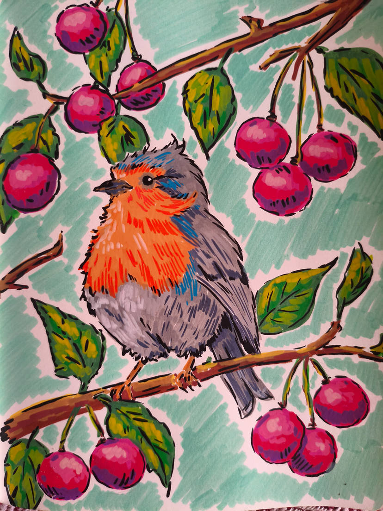

# 手绘马克笔插画风 (Hand-drawn Marker Illustration)

新增风格(暂未列入上级 20 种总览)。气质介于 #4 手绘卡通风 与 #12 水彩绘本风 之间,但以**马克笔笔触 + 粗黑墨线 + 民艺装饰感**自成一格。



> **图 6**:马克笔手绘的知更鸟与浆果枝。粗黑墨线描边、松散速写线条、高饱和明亮色、可见马克笔笔触与排线阴影,传统纸面手绘的童趣治愈感。

## 风格还原点

- **粗黑墨线描边**:轮廓用粗黑线,松散自然的速写线条而非精修矢量
- **马克笔笔触**:可见的马克笔涂色痕迹与排线(hatching)阴影,纸面质感
- **高饱和明亮色**:儿童绘本式鲜艳配色,装饰性平面构图
- **半写实童趣造型**:形体半写实但童趣化,温暖治愈、民艺感

## 参考 Prompt

**中文**:手绘马克笔插画风格,粗黑色墨线描边,松散自然的速写线条,高饱和明亮色彩,儿童绘本插画质感,装饰性构图,传统纸面手绘感,可见马克笔笔触和排线阴影,半写实但童趣化造型,温暖治愈,民艺感,2D hand-drawn illustration,storybook art style。

**English**:
```
hand-drawn marker illustration style, bold black ink outlines, loose sketchy linework,
vibrant saturated colors, children's book illustration aesthetic, decorative composition,
traditional paper texture, visible marker strokes, hatching shadows, semi-realistic but
whimsical forms, cozy handmade feeling, folk art inspired, 2D illustrated game art,
storybook visual style
```

**English(更偏游戏美术)**:
```
whimsical hand-drawn 2D game art style, cozy storybook illustration, bold ink contour lines,
visible marker coloring, vibrant natural color palette, sketchy hatching, handmade paper
texture, decorative flat composition, charming casual game visuals, folk-inspired
illustrative art direction
```

**Negative**: photorealistic, 3D render, smooth digital painting, realistic lighting, cinematic, hyper-detailed, vector art, anime style, clean polished concept art, glossy surfaces, airbrush shading, realistic anatomy, ultra sharp rendering.

**最准确关键词组合**:手绘马克笔 + 粗线描边 + 儿童绘本 + 民艺装饰感 + 2D cozy game illustration

> 来源:用户提供 Prompt 与示例图(`marker-robin.png`)。
