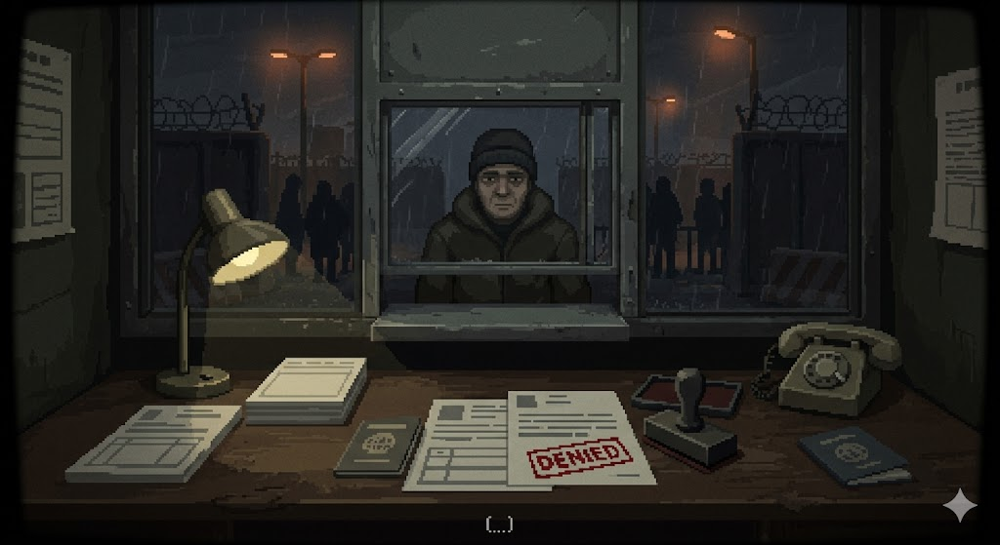

# 低饱和叙事风 (Muted Narrative Art)

关联总览表 #13 [低饱和叙事风 / Muted Narrative Art](../../README.md#1-2d-游戏典型画风总览20-种),典型代表作《请出示文件 / Papers, Please》。融合 #1 复古像素 + #10 极简几何 UI。



> **图 4**:低饱和叙事风的边境检查站。注意画面中灰暗压抑的色调(低饱和叙事)、粗糙的像素质感(复古像素风),以及桌面上几何块面化的通行证和印章(极简几何 UI),视觉完全在为"审查官"这种压抑的情绪和叙事体验服务。

## 美术总监视角拆解

- **低饱和叙事风(主基调)**:摒弃高纯度色彩,大量冷灰 / 土褐 / 暗绿。"脏脏"的颜色不为吸睛,而是传递官僚体制的僵化与压抑,让玩家立刻代入沉重背景。
- **复古像素风(表现技法)**:不追求"次世代像素"的华丽光影,刻意保留早期 DOS / Windows 3.1 时代的低分辨率粗糙感;人物面部模糊、去个性化,强化"众生相"的叙事隐喻。
- **极简几何(交互设计)**:文件、护照、印章、窗口分割线全部简化为最基础的矩形与线条。"功能绝对优先"的排版模拟冰冷办公桌面,把注意力高度集中在"核对信息"这一核心玩法。

## 参考 Prompt

```
A low-resolution pixel art scene of a gloomy bureaucratic border control checkpoint with
minimalist geometric documents and a red stamp on a desk, a citizen seen through a small
window, muted color palette, low saturation, oppressive atmosphere, narrative indie game
style, 2d game asset --ar 16:9
```

**Negative**: vibrant saturated colors, cheerful mood, high-detail HD-2D lighting, photorealism, 3D render, clean glossy UI.

> 来源:用户提供示例图(`border-checkpoint.png`)与拆解。
