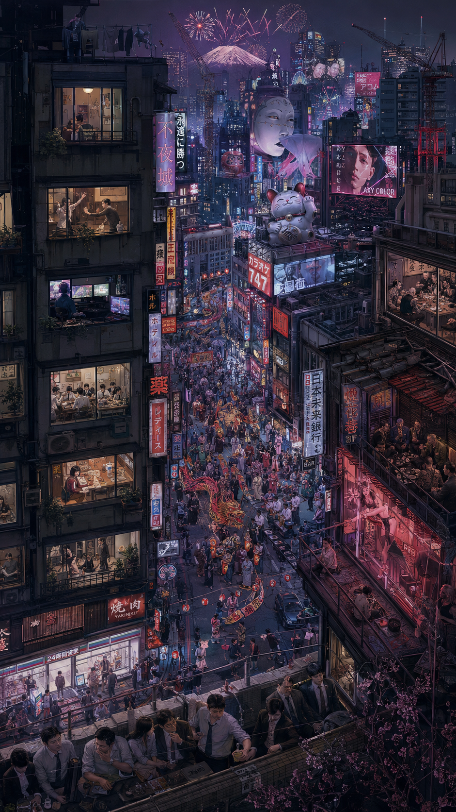

# 超现实日式未来都市 (Surreal Japanese Megacity)

新增风格(暂未列入上级 20 种总览)。属**超高清叙事插画 / 高密度俯瞰群像**——靠极致细节与情绪叙事取胜,接近评奖体系里的"独立美学手绘 + 高精写实"混合,见 [`../../2000-2026-top-art-game.md`](../../2000-2026-top-art-game.md)。



> **图 7**:超现实主义日式未来都市夜景。传统文化游行、小巷黑帮、烟花巷舞女、疲惫社畜,楼房窗内学习的学生、吵架的夫妻、玩游戏的宅男……在拥挤的繁华里讲"无聊、孤独与病态的美感"。9:16 竖构图。

## 风格还原点

- **高密度俯瞰群像**:斜俯视构图,远景富士山 + 中景街道游行 + 近景楼房窗格,层层可读
- **窗格叙事**:每扇窗 / 每个店面是一个独立微叙事(社畜、情侣、宅男、舞女),用细节堆叙事而非堆乱
- **超现实符号**:巨型招财猫 / 能面气球 / 霓虹汉字招牌,真实城市混入超现实意象
- **冷紫夜色 + 暖红霓虹**:整体冷调压抑,局部暖光点睛,繁华与孤独对冲
- **审美优先**:细节服务于构图与情绪,不为堆量牺牲协调感

## 参考 Prompt

**中文**:超现实主义的日式未来都市夜景,超高清精细插画,斜俯视 9:16 竖构图;街道上传统文化游行的人群、小巷里的黑帮、烟花巷的舞女、疲惫的社畜,楼房窗内有学习的学生、吵架的夫妻、玩游戏的宅男,各式人物海量细节;远景富士山与摩天楼群,巨型招财猫与能面气球等超现实符号,冷紫夜色与暖红霓虹对比;讽刺拥挤繁华下的无聊与孤独,病态而高级的美感,极高审美价值,构图协调统一。

**English**:
```
surreal Japanese futuristic megacity at night, ultra-high-detail narrative illustration,
high-angle bird's-eye 9:16 vertical composition, dense crowds with a traditional festival
parade, yakuza in back alleys, courtesans in a red-light lane, exhausted office workers,
apartment windows each telling a micro-story (studying students, a quarrelling couple, a
gamer otaku), giant surreal lucky-cat and noh-mask balloons, neon kanji signage, distant
Mt. Fuji and skyscrapers, cold purple night vs warm red neon, melancholy beauty of loneliness
amid crowded prosperity, extremely high aesthetic value, balanced harmonious composition
```

**Negative**: low detail, empty scene, flat lighting, cluttered incoherent composition, blurry, photorealistic photo, simple cartoon, low aesthetic.

> 来源:用户提供 Prompt 与示例图(`japanese-megacity.png`)。
